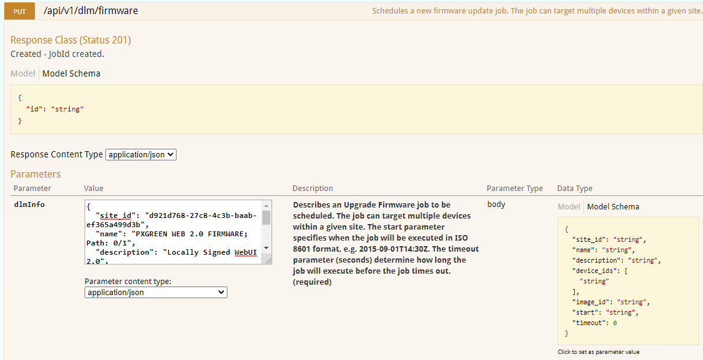
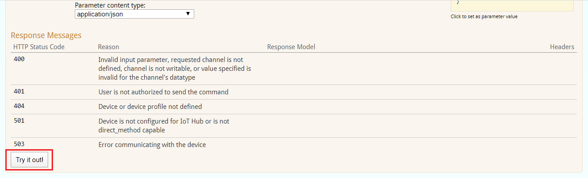
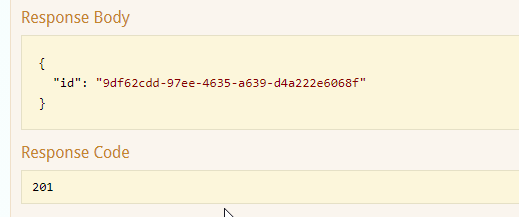
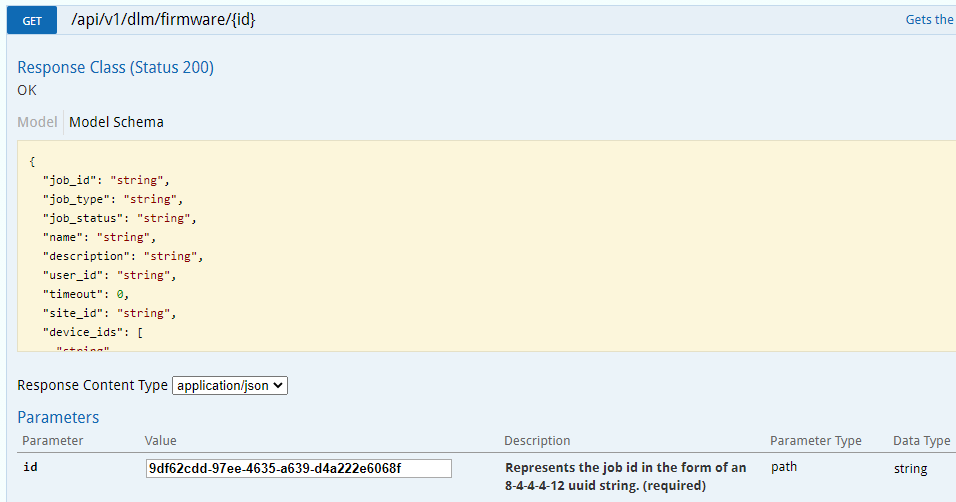

# How to use Swagger to do a Firmware Update

This guide will show how to do a Firmware Update for one image using the Swagger interface.

## Preliminaries

* You will need a login to your IoT Hub. 
  * Normally your Eaton email address is your username, but the password is different than your Eaton Windows password.
  * A PX White admin will help you to get this login.
* You (or a coworker) will need to push the new firmware image(s) to your IoT Hub.
  * See [How to push Blobs to Azure](how_to_push_blobs_to_azure.md)  to do this yourself
  * You will need the Blob UUID(s) for the images you want to use for the Firmware Update(s) below.

### Create your Firmware Update messages

It is very helpful to create the JSON message(s) that you will need for the Schedule Firmware Update command ahead of time,
and to keep them in a text file that you can pull up when you need them. Quite often, only the Blob UUID will change
between uses, and sometimes even that will not change when a fresh firmware image is pushed.

Here is an example message for updating the Web UI image, with the fields explained below:

```json
{
  "site_id": "d921d768-27c8-4c3b-baab-ef365a499d3b",
  "name": "PXGREEN WEB 2.0 FIRMWARE; Path: 0/1",
  "description": "Locally Signed WebUI 2.0",
  "device_ids": [
    "09aee7f7-60a0-4519-b642-740b788c01a2"
  ],
  "image_id": "af3cd06a-5fe8-4be0-9871-20bf90a40edb",
  "start": "2020-09-10T00:00Z",
  "timeout": 2000
}
```

Field name  | Description
----------- | -----------
site_id     | The UUID for this site. You can learn this from the API: GET /api/v1/devices/{id}
name        | Free text for the name of this update job, EXCEPT that you must provide the text "Path: X/Y" for the Processor/Image indices
description | Free text describing the Firmware Update. This, and the name, will appear in the Job results.
device_ids  | Array of one or more main device UUIDs to be updated
image_id    | The UUID for the blob containing the image to be used for this update
start       | The time that the update is scheduled to occur; if the time is in the past, it will be done immediately.
timeout     | The timeout, in seconds, that PX White should use to end the job if it has not been completed; this is total duration time.

The FUS Processor/Image indices are explained in [section on Processors and Images](@ref fus_indices).

Experience will show what is a suitable timeout value; you want it long enough for all cases, including network interruptions, but not so long that a genuine failure (that is not reported by the target device) doesn't result in the job waiting too long to realize that it has failed.
If the device reports a failure status, the job will end right then, without hitting the timeout.


## Initial steps

1. Open [Swagger page](https://adopteriotwebapi.eaton.com/swagger/ui/index#/) and enter your username and password

2. Click on the DLM API section to expand it  (DLM = Device Lifecycle Management)


## Schedule a Firmware Update

1. Click on API "PUT /api/v1/dlm/firmware" to expand

2. Paste your Firmware Update message (see above) into the dlmInfo window.

.

3. Click on try it out button



4. Now you should see the response code as 201(success) and the Response Body from PX White showing the Job UUID.



5. Copy the UUID of the "id" given in that response; this is the Job UUID that you will need in the next section to see the results.


## Check on Job Status

1. Click on API "GET /api/v1/dlm/firmware/{id}" to expand

2. Paste your Update Job UUID (from the last section) into the dlmInfo window.

.

3. Click on try it out button


4. Now you should see the status in the Response Body, consisting of the various steps and status updates, ending with Success or Failure.

