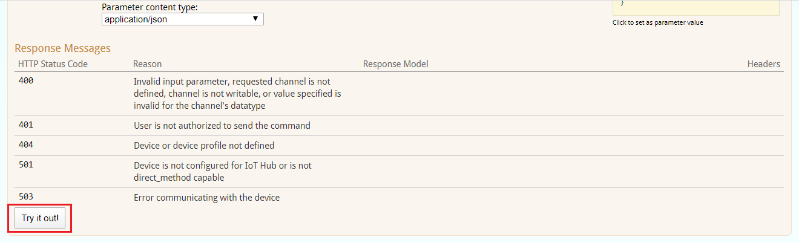

# How to use Swagger to send Cloud-to-Device (C2D) commands

## Initial steps

1. Open [Swagger page](https://adopteriotwebapi.eaton.com/swagger/ui/index#/) and enter your username and password

2. Click on command API to expand it  

## Set single channel value

1. Click on API "PUT /api/v1/devices/{id}/commands/setchannelvalues" to expand

2. Enter your device GUID

3. When you click on model schema, the text present in model schema will appear in parameters section

4. In parameters section, enter tag ID and value that you want to set. For eg, set value 44 to tag ID 102919

5. Click on try it out button

6. Now you should see the response code as 200(success) and the response from device will be shown in response body

## Set multiple channel values

Follow all the steps same as that of [Set single channel value](#set-single-channel-value) except step number 4. Suppose if you want to set value 44 to multiple tags like 102919 and 102920 then parameters section should be as follows.

## Get single channel value

1. Click on API "PUT /api/v1/devices/{id}/commands/getchannelvalues" to expand

2. Enter your device GUID

3. When you click on model schema, the text present in model schema will appear in parameters section

4. In parameters section, enter tag ID whose value you want to read. For eg, tag ID 102919

5. Click on try it out button

6. Now you should see the response code as 200(success) and the response from device will be shown in response body containing tag ID and its value

## Get multiple channel values

Follow all the steps same as that of [Get single channel value](#get-single-channel-value) except step number 4. Suppose if you want to get the value of multiple tags like 102919 and 102920 then parameters section should be as follows.

## Send a custom Device Command - QueryProcessorImages

### Preliminaries

When you create a new custom command, you must do two things for it with PX White:
1. Register the custom command in your IoT Hub with PX White
2. Authorize yourself and any other users to be allowed to execute this command.

You will need assistance from a PX White admin to do these things.

### Example with QueryProcessorImages

This is a "custom" command that has been added in the IOT_Fus code.

1. Click on API "PUT /api/v1/devices/{id}/commands/{command_instance_id}" to expand

2. Enter your device UUID
3. Get a UUID to put in the command_instance_id field, eg, using an [online UUID Generator](https://www.uuidgenerator.net/)

4. When you click on model schema, the text present in model schema will appear in parameters section

5. Set the method name to "QueryProcessorImages". Leave the "parameters" field with empty curly braces (there are no arguments for this command).

6. Click on try it out button

6. Now you should see the response code as 200(success) and the response from device will show the processor and images information, including versions, from the device.
