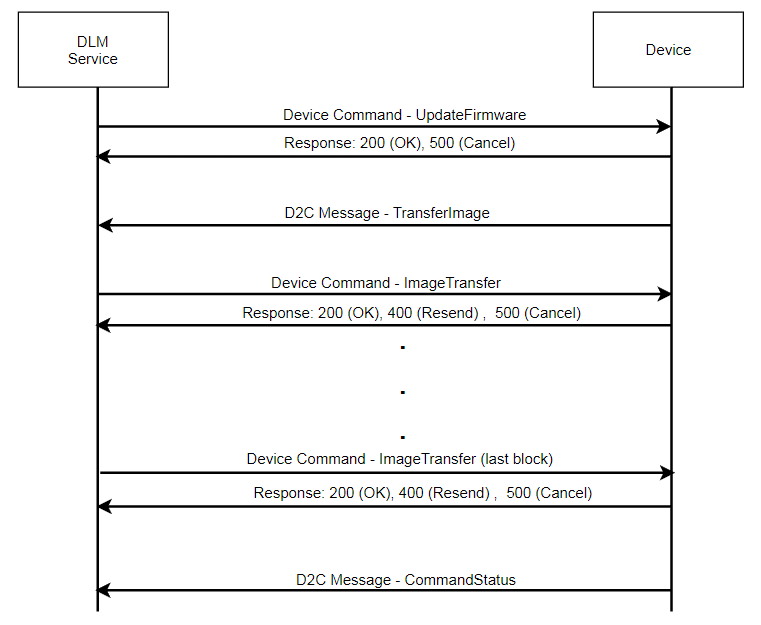

# Firmware Update Service (FUS) over IoT

## Azure, PX White DLM, and PXGreen Firmware Update Service (FUS)

There are many pieces working in concert to do FUS over IoT:

* C2D Device Command support
* PX White's Device Lifecycle Management (DLM) APIs
* The C2D and D2C Commands for FUS over IoT
* The Babelfish FUS over IOT code
* Processors, Images, and the Babelfish FUS code
* Product-based support and customization of FUS over IoT
* Blob Storage in Azure
* Product configuration and Codepacks

These areas are explained in the following sections. The overall design of FUS over IoT
is described in [this confluence page](https://confluence-prod.tcc.etn.com/display/LTK/Design+of+FUS+over+IoT).

## Cloud-to-Device (C2D) Device Command Support

The C2D commands that initiate FUS and provide its image data are first received by the C2D_Device_Command_Callback
and IOT_Device_Command::Execute_C2D_Command() handlers; the latter calls IOT_Fus::Command_Handler() to let the IOT_Fus
class handle its commands.

The response to each command is carried back through this IOT_Device_Command code; it consists of an HTTP status and message 
indicating success or failure, and, for the QueryProcessorImages command, the response data in the parameters structure.

See [Cloud-to-Device (C2D) Commands](iot_commands.md) for more details on C2D handling.

## PX White's Device Lifecycle Management (DLM) APIs

PX White implements its support for Firmware Update in its set of DLM APIs. Two APIs from the Swagger interface are of particular interest to us:

* Schedule Firmware Update - PUT /api/v1/dlm/firmware
  * This initiates the update process, sending the indicated image blob to the indicated device(s)
  * It returns the Job UUID that can be used to track the results of this update
* Get Update Job Status - GET /api/v1/dlm/firmware/{id}
  * This retrieves the results of an update process (job) for a given Job UUID.
  * It can indicate ongoing or final results.
  * The IOT_Fus code uses the IOT_Device_Command::Update_Device_Command_Status() to provide updates for the Job in progress, which are seen as steps in the results from this API.

See [How to - Firmware Update](how_to_do_firmware_update.md) to do this yourself.

## The C2D and D2C Commands for FUS over IoT

Once the Firmware Update has been scheduled, and the time to execute it has come or has passed, doing 
the Firmware Update is a multi-step process, using a mix of C2D and D2C commands; 
the following sequence diagram copied from the [PX White DLM descripton page](https://confluence-prod.tcc.etn.com/display/IoTPlatform/Firmware+Update) helps clarify the order and direction of the commands:

The commands themselves are briefly described in the next sections; the contents are described in the [PX White DLM descripton page](https://confluence-prod.tcc.etn.com/display/IoTPlatform/Firmware+Update).

### C2D UpdateFirmware command

This is the command that initiates a Firmware Update. It is basically a challenge: do you want to accept a firmware update with the 
given parameters? These parameters are mix of blob metadata (properties archived with the image file) and job properties provided for this instance when scheduling the Firmware Update.  The IoT and product code jointly check these parameters and determine if the update is acceptable, and if the device is in a state where Firmware Updates are acceptable, and return an OK status or a failure with
a stated reason. This command is handled by the IOT_Fus::Update_Firmware() method.

### D2C TransferImage command

Once the device has accepted the UpdateFirmware command and returned an OK, it erases the Scratch area in preparation for the image download,
and then sends this command to PX White, to tell it what chunk size to use when sending image data. This "chunk_size" is set to IOT_Device_Command::m_TRANSFER_IMAGE_CHUNK_SIZE, to limit how large a chunk can be sent in the ImageTransfer messages. (The actual data length in the ImageTransfer message will be 4/3 of this raw bytes size, due to Base64 encoding.)

### C2D ImageTransfer command

PX White sends one chunk of image data with this command. That data is Base64 encoded for the transfer, so the first step is to decode
it back into binary bytes. Then the image bytes are written to the Scratch area, at the given offset. This is handled by the IOT_Fus::Handle_Image_Transfer() method.

When the command indicates that we have received the last chunk, IOT_Fus::Handle_Image_Transfer() invokes the FUS methods to initiate and
carry out the Firmware Update, and then send the final success or failure status.

### D2C DeviceCommandStatus command

At the beginning of the FUS steps, and when the update attempt has finally succeeded or failed, the device sends a DeviceCommandStatus message,
keyed to the Update Job UUID, to tell PX White of its status. It uses the IOT_Device_Command::Update_Device_Command_Status() method for this.

### C2D QueryProcessorImages command

This is a custom C2D command that is not part of the standard PX White DLM process. It can be used by cloud App to learn what versions the device images are at, in order to see when they need to be updated. Its response lists the version information for all the device processors and images.
It is fully described in the [Design of FUS over IoT page](https://confluence-prod.tcc.etn.com/display/LTK/Design+of+FUS+over+IoT#DesignofFUSoverIoT-QueryingProcessorImagesandVersions).

This [How To](how_to_send_c2d_commands.md) also shows how you can send and see the results of this command.

## The Babelfish FUS over IOT code

The IOT_Fus class manages almost all of the operations pertaining to the communications for FUS over IoT.
The IOT_Device_Command class manages the callback that receives C2D commands like UpdateFirmware and ImageTransfer, then calls IOT_Fus::Update_Firmware() or IOT_Fus::Handle_Image_Transfer() to do something with the commands and provide a response.
If you trace the callbacks for either of these, you can see where it starts in the Eaton IoT SDK with receiveC2DDeviceCommandCallback().

The following diagram shows the sequence of operations during a normal, successful Firmware Update process. The participants are

* PX White - issues the C2D commands, starting the Firmware Update process, transferring chunks, getting status updates
* Babelfish IoT - the code in Babelfish which manages the IoT operation, including handling the DLM commands;
not showing the Azure and Eaton IoT SDKs here through which commands and responses pass.
* IOT_Net Timer Task - IOT_Net::Timer_Task() is the timer-driven heart of IoT actions; 
here it schedules D2C commands like TransferImage and DeviceCommandStatus, as well as driving the IoT FUS State Machine
* IoT FUS State Machine - executes the selected state if/when its timer expires; 
IOT_Fus::Scheduled_State_Machine_Handler() is called by IOT_Net::Timer_Task() when its timeout has expired
* Babelfish FUS - the code in Babelfish which manages the Firmware Update Services (FUS)
* Flash - the hardware for storage of code, internal (to the CPU) or external

@startuml "Sequence Diagram for FUS over IoT"
participant "PX White" as PXWhite
participant "Babelfish IoT" as IOT
control "IOT_Net Timer Task" as Timer
control "IoT FUS State Machine" as States
participant "Babelfish FUS" as FUS
entity Flash

PXWhite -> IOT : UpdateFirmware command
IOT -> FUS : Get Processor/Image Parameters
FUS -> IOT
IOT -> PXWhite : Status OK
IOT -> FUS : IOT_Fus::Create_Session()
FUS -> IOT : Session ID
IOT -> Timer : SCHEDULED_ERASE_FUS, 1s
Timer -> States : Do SCHEDULED_ERASE_FUS
States -> FUS : Erase Scratch Area
FUS -> Flash : Erase flash sectors for Scratch Area
States -> Timer : Schedule TransferImage command
States -> Timer : SCHEDULED_RESET_FUS, 90s
Timer -> IOT : Send TransferImage
IOT -> PXWhite : TransferImage, with desired chunk size, 0s delay
PXWhite -> IOT : ImageTransfer command, with first chunk
IOT -> FUS : Write chunk
FUS -> Flash : Write chunk to start of Scratch Area
IOT -> IOT : Delay ~20s
IOT -> Timer : SCHEDULED_RESET_FUS, reset to 90s
PXWhite -> IOT : ImageTransfer command, with chunk offset XXXX
IOT -> FUS : Write chunk
FUS -> Flash : Write chunk to offset XXXX
IOT -> Timer : SCHEDULED_RESET_FUS, reset to 90s
..."Many chunks later"...
PXWhite -> IOT : ImageTransfer command, with last chunk offset XXXX
IOT -> FUS : Write chunk
FUS -> Flash : Write chunk to offset XXXX
IOT -> Timer : Schedule DeviceCommandStatus "Starting Flash Update"
IOT -> FUS : Validate_Image
Timer -> IOT : Send DeviceCommandStatus
IOT -> PXWhite : Send DeviceCommandStatus
FUS -> IOT : Is valid
IOT -> FUS : Commit
FUS -> Flash : Copy full image from Scratch to target sectors
IOT -> FUS : Done?
FUS -> IOT : Waiting for callback
IOT -> Timer : SCHEDULED_STATUS_FUS, delay from FUS operation
Timer -> States : Do SCHEDULED_STATUS_FUS
States -> FUS : Done?
FUS -> States : Done!
States -> PXWhite : Send DeviceCommandStatus for Done with Success
..."If doing App Image update"...
States -> Timer : SCHEDULED_SYSTEM_RESET_FUS, after 10s delay
Timer -> States : Run - do Reboot

@enduml

### Memory management for C2D Device Commands

It is worth noting that storage for the copy of the incoming command is malloc'd rather than using the fixed IOT_MESSAGE iotMessage[] array.
One reason for this is to not limit the size of incoming commands, or to overburden the iotMessage[] array with maximal allocation based
on the occasional large C2D commands.

The maximum C2D command size is set by the ImageTransfer commands, each of which carries one chunk of image data, Base64 encoded.
However, the device gets to set what that (decoded) chunk size is when it sets the "chunk_size" to IOT_Device_Command::m_TRANSFER_IMAGE_CHUNK_SIZE in the TransferImage command.

## Processors, Images, and the Babelfish FUS code {#fus_indices}

The Babelfish FUS code supports a hierarchy with a list of Processor(s), where each Processor has one or more Images.
As in the REST interface for FUS, the text added to the Firmware Update Job Description, "... Path: X/Y", 
indicates the targeted Processor (index = X) and Image (index = Y). 
For example, the Web UI image in the main processor is "Path: 0/1".

The regular Babelfish FUS code is able to handle the updating of the App, Web UI, and Languages images of the main processor.
So once the IoT code determines that it can proceed with the Firmware Update, it uses the FUS operation to erase the Scratch area
of the flash, where it will write the image data as it receives it from PX White.

Then, when the last chunk of image data has been received, the IoT code will invoke the FUS operations to validate and write
that image to its proper location, and then provide the success or failure result. 
This all happens within method IOT_Fus::Handle_Image_Transfer().

## Product-based support and customization of FUS over IoT

The Product code knows the specifics of flash allocations, Processor(s), and Images for a particular product, so of course
it provices important input to the common IoT handling of the Firmware Update process.
The Babelfish IoT code will also defer to the Product code for help deciding if the UpdateFirmware parameters are
acceptable, and if the system is in a state where it can proceed with a FUS update.

The Product code must also provide the FUS support for the Processors beyond the main processor 
(eg, communication or branch circuit monitoring modules).  Once an image for these Processors has been fully 
received by the IoT code, it will defer to the Product-based FUS process to use the image data.

The most important configuration item for FUS over IoT is the setting for `__ICFEDIT_size_heap__` in the linker
configuration file (.icf); it must allow enough heap for the commands, particularly ImageTransfer, to be
received and deserialized.

The next important, and related, configuration item is the "chunk_size" set in IOT_Device_Command::m_TRANSFER_IMAGE_CHUNK_SIZE, 
which limits how large a chunk can be sent in the ImageTransfer messages. 
This is a tradeoff between memory consumption / allocation and download duration; obviously it takes longer to receive a
given image when a smaller chunk size is selected.

## Blob Storage in Azure

Azure provides the ability to store and retrieve files, which is known as "Blob Storage".
In Azure terms, any file which is stored is called a "Blob"; these are generally binary
files (like firmware or PDFs) but could also be text files.

Eaton uses a small program to push files to Azure Blob Storage, and these Blobs are then
downloaded to devices for firmware updates via the IoT code.
The important link is the UUID of the blob, given by the program that pushes it to Azure,
and needed by the PX White API for Scheduling a Firmware Update.

### How to push Blobs to Azure

There is a program called UploadBlob.exe, written in C#, that will Base64 encode a binary firmware image and post it to the Azure blob storage. 
It reads a configuration file for its input parameters, connects to Azure, does the blob upload, and reports the blob's UUID.

The full How-To is described in [How to push Blobs to Azure](how_to_push_blobs_to_azure.md).

## Product configuration and Codepacks

The Codepack generation process must be used for the App, Web UI, and Languages images, even though we do not use the Codepacks 
directly for the Blob Upload process; it is necessary because this generates the signed binary images (the .bin files) that
we do use for Blob Upload. 
See the [confluence page](https://confluence-prod.tcc.etn.com/display/LTK/Build+Firmware+Code+Pack) for more details.

## Babelfish Modules

[Firmware Update over IoT](@ref fus_over_iot)

