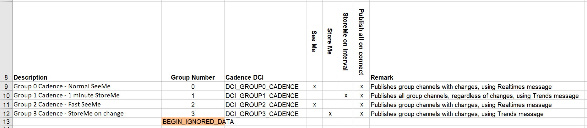
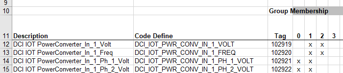

# IoT Data Publishing and Group Cadence

## Initially published messages

After first connecting to Azure, or every time after reconnecting, the IOT_Net::Timer_Task() arranges to publish:

* The DeviceTree message
* The Realtimes messages for each Cadence Group with this type *(configured to do so by default)*
* The Trends messages for any Cadence Group with this type *(configured to do so by default)*

The DeviceTree message will only be sent once at (re-)connection time.
*(Provision might later be made to resend it if any of its information changes, but that is not an important use case at this time.)*

The Realtimes messages will, for this initial publishing, contain every channel that is configured for each Cadence Group, regardless of change in value.
This is important to do so that PXWhite can have a reliable starting point for each channel; it is most important for static or infrequently changed values.
This is unlike the subsequent Realtimes messages, which will only contain channels whose values have changed.

The Trends message(s) will contain all the channels that are members of a Cadence Group that has the trend publishing type. Every subsequent Trends message will also contain all the trended channels.
There is an exception if all the channels cannot fit in one trend message; then multiple messages will be required to send all the channels, but they will be sent as close together as is practical.

## DeviceTree message

The DeviceTree message contains static information about each configured device, starting with the main or "Publisher" device.
The Publisher device is the one whose UUID matches the DeviceId portion of the Azure ConnectionString; it is the "parent" of any other devices.

In the common PXGreen case, there is only one device.

If the Publisher has child devices, they are listed under the Publisher (in the "ds" array), and their information is also provided in this message.

The following is an example DeviceTree message for a single device:

```json
{
    "d": {
        "d": "09aee7f7-60a0-4519-b642-740b788c01d2",
        "profile": "66d8c394-9627-4a85-ad00-d45427885135",
        "name": "RTOS TOOL KIT",
        "serial": "0",
        "asset": "Asset Name",
        "mac": "00:D0:AF:05:B3:8C",
        "ds": []
    }
}
```

## SeeMe/Realtimes message

The Realtimes message is also known as a "SeeMe" message, since PXWhite only holds the last value published as a realtime for a given channel, ie, without history; so you can only See that last value.
This type is useful for dashboards and readouts that are focused on latest readings, or for channels whose values are static or only change infrequently.
This type is also important for status or alarm channels, where you want PXWhite to quickly have the change in status.

The following is an example Realtimes message; note that the timestamp is  provided for each channel, with millisecond resolution:

```json
{
    "realtimes": [{
        "c": "102919",
        "t": 1586205425,
        "t_ms": 0,
        "v": "4800"
    }, 
    ...
    {
        "c": "102959",
        "t": 1586205425,
        "t_ms": 0,
        "v": "97"
    }]
}
```

Note also that the channel is identified by its PXWhite "tag" (eg, "102919"), which is a numeric ID assigned by PXWhite when the channel is added to the device profile.

## StoreMe/Trends message

The Trends message is also known as a "StoreMe" message, since PXWhite archives the value and timestamp for each channel in the message.
The channel does not have to be "trended" in the conventional sense (eg, Min/Avg/Max within a fixed interval);
the Trends message type indicates that any data provided is to be archived.

The following is an example Trends message; note that the timestamp is provided for each channel, with resolution in seconds:

```json
{
    "trends": [{
        "c": "102919",
        "t": 1586205425,
        "v": "4800"
    },
    ...
    {
        "c": "102959",
        "t": 1586205425,
        "v": "97"
    }]
}
```

The "actual" trend type ("v") is shown; other types are "min", "avg", and "max", though these are not currently used in PXGreen.

## Cadence Groups

The "IOT Groups" tab of the DCI Creator spreadsheet defines the Cadence Groups for each product, and the "IOT" tab of the DCI Creator assigns each channel selected for IoT publishing to one or more groups.

The traits for each Cadence Group are:

* Cadence Rate (in seconds): the interval used for this group, with any data published only at the end of the interval.
* The published type: SeeMe, StoreMe *(aka StoreMe on change)*, or StoreMe on interval

This is shown in this example of the IoT Groups tab:



Once the groups have been defined, the channels can be assigned to the groups, as shown in this example of the IoT tab:



### Notes on Cadence Groups

1) If a channel is assigned to multiple groups with SeeMe/Realtimes type, the one with the shortest cadence always "wins" - any changes will be published at the shorter cadence. So it normally does not make sense to put a channel into more than one group with the SeeMe/Realtimes type.
2) For a similar reason, it is probably better to define groups with StoreMe/Trends type without SeeMe/Realtimes (the "both" option).

## When and What Cadence Groups publish

Each Cadence Group is treated independently of the other groups; each has its own Timer task and its own Change Tracker *(if it has the SeeMe/Realtimes type or StoreMe aka StoreMe on change)*

The Timer is started when the device first powers up, if the IoT code has been enabled for the build. The Timer is configured to run continuously, with the Cadence rate used as the retrigger interval, and to run the Timer task at the end of each interval.

If the Cadence Group has the SeeMe/Realtimes type or StoreMe *(aka StoreMe on change)*, it will

* Check with its Change Tracker to see if any of its channel values have been updated (and changed) in the DCI
* If so, they will be published together in a "Realtimes" or "Trends" message as per configuration
* The present time ("now") will be used as the timestamp
* The Change Tracker will clear the flags that showed the changed channels,
so that if the channels change again, they will be published next time.

If the Cadence Group has the StoreMe on interval type, it will publish a Trends message with the latest values from every channel in the group, using the present time as the timestamp. The Cadence Interval is not synchronized to specific times on the clock (eg, 12:00:00), but the Timer will keep it regular at the configured Cadence Interval.

### More detailed explanation

Since the Timers in the FreeRTOS system all run from the same task, it is important to minimize the time spent in the actual Timer tasks. Consequently, the IOT_Group_Handler::Cadence_Check_Timer_Task() does not actually do the publishing of channel data; instead, it just quickly sets a flag in IOT_Net via IOT_Net::Mark_Group_Ready() and returns.

When IOT_Net::Timer_Task() is called as part of the IoT SDK's messageThread() task, it will check its m_groups_ready flags to see which Cadence Groups need to have either type of message published, and call IOT_Pub_Sub::Publish_Channel_Data() to do this.

IOT_Pub_Sub::Publish_Channel_Data() will call  IOT_Pub_Sub::Publish_SeeMe_Realtimes_Message() and/or
IOT_Pub_Sub::Publish_StoreMeOnInterval_Trends_Message and/or
IOT_Pub_Sub::Publish_StoreMe_Trends_Message() to do the data gathering and publishing.
An important sub-function is IOT_Pub_Sub::Get_Updated_Fitting_Channels(), which calls IOT_Group_Handler::Peek_Next_Channel() to find out from the ChangeTrackerPlus which channel(s) have been updated and are therefore in need of publishing.

## Message buffer size and count

If you look into the Eaton IoT SDK code, you will notice that parts of the code are divided by `#ifdef PX_GREEN_IOT_DEVICE` statements into an implementation for PXGreen or PXRed. One very important difference is that PXGreen does not malloc the message buffers it uses to publish messages; instead, they are pre-allocated using IOT_MAX_OUTBOUND_BUFFER_SIZE and IOT_MAX_CONCURRENT_MESSAGES, for the buffer size and number of such buffers, respectively.

The defaults are IOT_MAX_OUTBOUND_BUFFER_SIZE = 512 bytes and IOT_MAX_CONCURRENT_MESSAGES = 4 messages, though these values are expanded for the CPU types with more available RAM, such as the STM32F765 and 767 in IOT_Config.h.

One of the important aspects of the IOT_Pub_Sub::Get_Updated_Fitting_Channels() and IOT_Pub_Sub::Get_All_Fitting_Channels() is to estimate the size of the message after each channel's value and timestamp are serialized in the IoT SDK for publishing; these functions will stop accepting more channels to be published in the current message once the limit of the message buffer is reached.

If your product has sufficient RAM available, you should allocate enough for message buffers so that all of your channels can be published.

## Modules

[IoT Publishing and Group Cadence code](@ref iot_publish_cadence)
